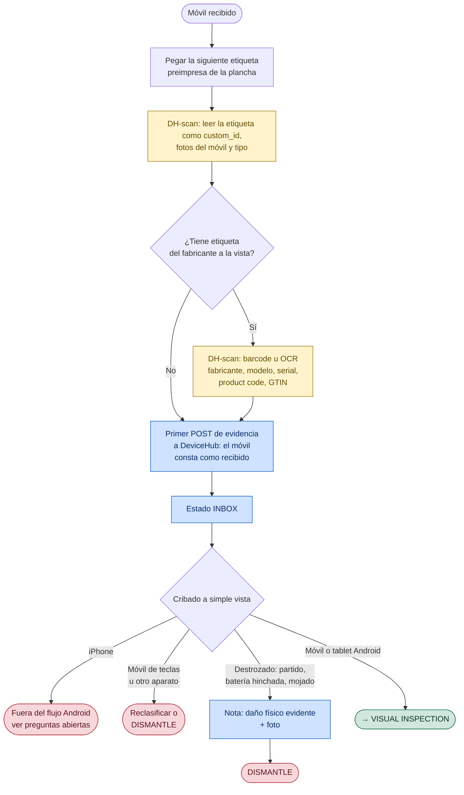
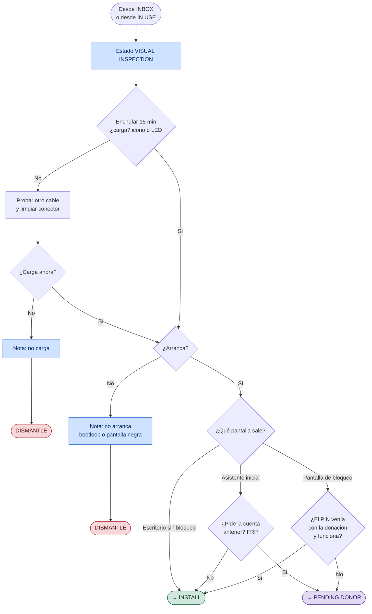
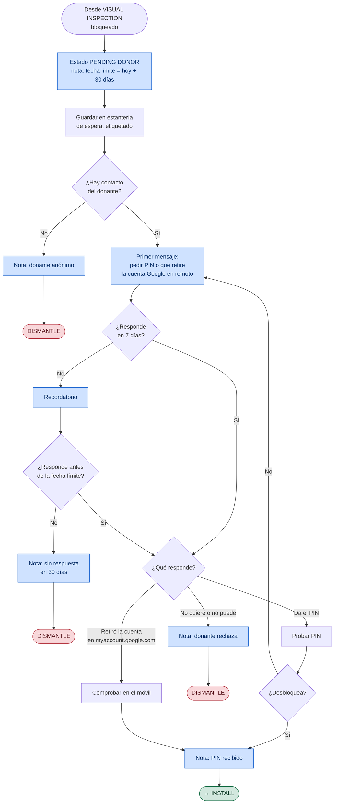
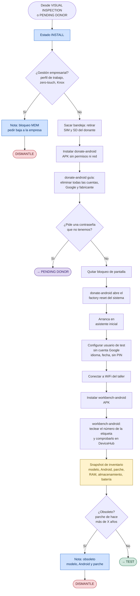
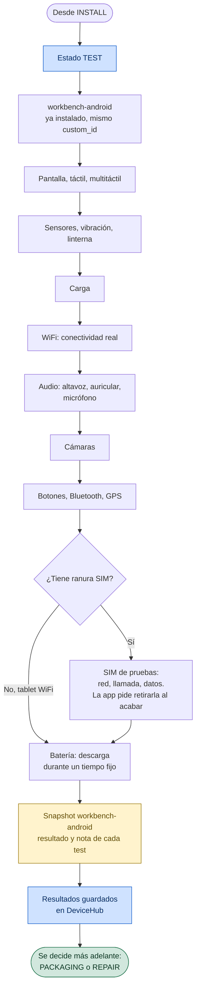
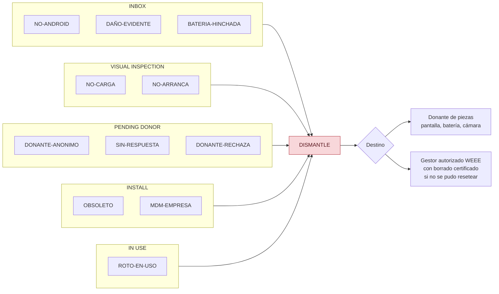

# Diagramas detallados del reacondicionado de móviles

Desarrolla el [diagrama de alto nivel](diagrama-alto-nivel.md) estado a estado,
encajando cada caja del Lucidchart "Diagrama reparació Vincle Digital" en el
estado de DeviceHub donde ocurre.

## Leyenda

Todos los diagramas usan los mismos colores:

| Color | Significado |
|---|---|
| Azul | Algo queda escrito en DeviceHub: evidencia, cambio de estado, nota o propiedad |
| Amarillo | Checkpoint: evidencia de DH-scan o snapshot de workbench-android |
| Rojo | Salida a DISMANTLE. Siempre con nota del motivo |
| Verde | Sale del estado hacia el siguiente del camino normal |
| Morado | Estado nuevo que no existe todavía en DeviceHub |
| Gris | Documento o ficha de apoyo (cajas "documento" del Lucidchart) |

---

## 1. Máquina de estados

La vista completa: qué estados existen y qué transiciones son válidas. El
detalle de cada estado viene en las secciones siguientes.

```mermaid
stateDiagram-v2
    direction TB

    state "INBOX" as INBOX
    state "VISUAL INSPECTION" as VI
    state "PENDING DONOR (nuevo)" as PD
    state "INSTALL" as INSTALL
    state "TEST" as TEST
    state "REPAIR" as REPAIR
    state "PACKAGING" as PACK
    state "DONATION" as DON
    state "IN USE (nuevo)" as USE
    state "DISMANTLE" as DIS

    [*] --> INBOX: móvil recibido,<br/>primer POST de DH-scan
    INBOX --> VI: registrado
    INBOX --> DIS: daño evidente

    VI --> INSTALL: arranca y es accesible
    VI --> PD: bloqueado con PIN<br/>o FRP
    VI --> DIS: no carga<br/>o no arranca

    PD --> INSTALL: donante da el PIN<br/>o retira la cuenta
    PD --> DIS: sin respuesta en 30 días

    INSTALL --> TEST: reset hecho,<br/>usuario de test configurado
    INSTALL --> DIS: obsoleto,<br/>zero-touch, Knox

    TEST --> PACK: según resultados,<br/>se decide después
    TEST --> REPAIR: según resultados,<br/>se decide después

    REPAIR --> [*]: fuera de alcance<br/>por ahora

    PACK --> DON: entregado a receptor
    DON --> USE: receptor lo usa
    USE --> VI: devolución o<br/>cambio de persona
    USE --> DIS: se rompe sin arreglo

    DIS --> [*]
```

---

## 2. INBOX · Etiquetado y cribado rápido

Es un cribado de pocos segundos por móvil: se etiqueta, se da de alta y se aparta lo que se ve a simple
vista que no sirve. No se enciende el móvil ni se busca información del modelo:
en este punto se hace un primer registro en DeviceHub para tener constancia de los moviles que recibimos. 

**ID y etiqueta.** Las etiquetas se imprimen por adelantado en planchas A4
con numeración correlativa, con la herramienta `generar_planchas.py`. 

- El QR lleva solo el número, no una URL: DH-scan guarda el texto del QR tal
  cual como `custom_id`. En workbench-android el número se teclea y la app
  comprueba en DeviceHub que existe.

**Solo lo evidente.** Aquí se descarta lo que no necesita comprobación: pantalla
partida en trozos, batería hinchada (apartar el aparato por riesgo de incendio)
o señales claras de agua. El resto del hardware lo prueba
workbench-android en TEST.

Queda en DeviceHub al salir de INBOX:

| Dato | Origen |
|---|---|
| `custom_id` | QR de la etiqueta, leído por DH-scan y enviado en el primer POST |
| tipo | `DeviceType` de móvil o de tablet de la institución |
| fotos | DH-scan |
| fabricante, modelo, serial, product code, GTIN | Barcode u OCR de la etiqueta, si la hay, como propiedades |
| estado `INBOX` | Automático al crear el dispositivo con el primer POST, en el lote Inbox |

---

## 3. VISUAL INSPECTION · Carga, arranque y bloqueo

Responde a lo que
workbench-android no puede comprobar porque aún no está instalado: si el móvil
carga, si arranca y si podemos entrar. Todo lo demás se mira en otro sitio:

La carga va antes que el arranque porque un móvil sin batería no arranca y no
se puede distinguir de uno roto. No hace falta cargarlo más: basta con que
encienda.

Nunca se prueban PINs a ciegas: tras varios intentos el móvil se bloquea por
tiempo o se borra, y lo segundo deja el FRP armado.

---

## 4. PENDING DONOR · Espera del PIN (estado nuevo)

---

## 5. INSTALL · Borrado de cuentas, reset y registro con workbench-android

**donate-android** guía el borrado de cuentas y abre el factory reset del
propio Android: la app no puede hacer el reset ni saltarse nada. No pide
permisos ni tiene acceso a red, así que se puede instalar en un móvil que aún
tiene datos del donante. workbench-android, en cambio, se instala después del
reset.

El orden importa: cuentas fuera **antes** del reset. Si se resetea con la cuenta
puesta, el FRP aparece y solo el propietario puede quitarlo. No se intenta
ningún bypass de FRP.

### Qué reporta workbench-android

Lo que necesitamos del registro y lo que envía la app en el snapshot. Lo que
llega a DeviceHub como propiedad se ve en la ficha del producto.

| Dato | Para qué | En la app | En DeviceHub |
|---|---|---|---|
| `custom_id` | Unir con el alta de DH-scan | Se teclea y se comprueba que existe en DeviceHub antes de enviar (la etiqueta está en la trasera del propio móvil, su cámara no la ve) | Identificador del producto |
| Tipo | Móvil o tablet | `Smartphone` o `Tablet` (pantalla ≥ 600 dp) | Tipo del producto |
| Fabricante, marca, modelo | Ficha | Sí, de `Build` | Sí |
| Versión de Android, API | Ficha, obsoleto | Sí | `android:version`, `android:api_level` |
| Parche de seguridad | Decidir obsoleto | Sí, `Build.VERSION.SECURITY_PATCH` | `android:security_patch` |
| Obsoleto | Salida a DISMANTLE | No | Falta la regla: se decide con `android:security_patch` |
| CPU, RAM, almacenamiento, pantalla, cámaras, sensores | Ficha | Sí | Componentes |
| Batería: nivel, salud, voltaje, temperatura | Ficha, TEST | Sí | Componente batería |
| Ciclos de batería | Desgaste | Solo API 34+ y según fabricante | Sin alternativa fiable |
| Salud de batería en % | Desgaste | No, fijo a `null` | Depende del fabricante |
| Serial | Ficha | No | No accesible sin privilegios desde API 29. Sale de la etiqueta (DH-scan) |
| IMEI | Ficha, trazabilidad | No | No accesible desde API 29. `*#06#` a mano |
| SIM o SD dentro | Control de INSTALL, antes del reset | Parcial: el test de SIM pide retirarla | La SD no se comprueba |
| Specs PD (carga rápida) | Cargador de entrega | No | No lo expone Android: ficha del fabricante |

Falta fijar la X del criterio de obsoleto.

---

## 6. TEST · Diagnóstico con workbench-android

**La idea es que todos los tests se hagan desde workbench-android**, sin pruebas a
mano ni diagnósticos de fábrica: es la única forma de que el taller no pierda
tiempo y de que cada resultado quede en el snapshot.

Se pasan siempre todos los tests, aunque alguno falle. Los resultados quedan en
DeviceHub y la decisión de qué hacer con el móvil (PACKAGING o REPAIR) se toma
más adelante, fuera de este flujo.

### Qué hace workbench-android

Todos los tests del diagrama están en la app. Cada resultado llega a DeviceHub
como propiedad `hwtest:<id>`. Si cambia entre
pasadas, el cambio queda en el log del producto.

| Test | Ids de resultado | Cómo decide |
|---|---|---|
| Pantalla, táctil, multitáctil | `screen`, `touch`, `multitouch` | Operario; táctil pasa solo al cubrir la rejilla |
| Sensores | `accelerometer`, `gyroscope`, `magnetometer`, `proximity`, `light` | Pasa si la lectura cambia; SKIP si no existe |
| Vibración, linterna | `vibration`, `flashlight` | Operario |
| Carga | `charging` | Pass solo con el cargador detectado |
| WiFi | `wifi` | Pass solo con WiFi validada por el sistema |
| Audio | `speaker`, `earpiece`, `microphone` | Operario; auricular SKIP si no hay; el micrófono graba y reproduce |
| Cámaras | `camera_back`, `camera_front` | Operario con la vista previa; SKIP si no hay |
| Botones | `volume_up`, `volume_down`, `power` | Detectados: teclas de volumen y pantalla apagada |
| Bluetooth | `bluetooth` | Pass con al menos un dispositivo encontrado |
| GPS | `gps` | Pass con satélites visibles; la nota lleva satélites y fix |
| SIM | `sim`, `cellular_network`, `call`, `mobile_data` | SIM lista, registro en red, llamada por el marcador, datos validados. SKIP sin telefonía |
| Batería | `battery_drain` | Descarga de 15, 30 o 60 min; la caída va en la nota |

Sin probar todavía en un móvil real: leer un QR real, auricular, micrófono con
voz, Bluetooth con dispositivos cerca y la llamada. En el emulador funcionan el
recorrido completo, la reanudación y el envío a DeviceHub.

---|---|---|
| Pantalla, táctil, multitáctil, carga, sensores, vibración, linterna | Sí, guiado (`HwTestFlow.kt`) | |
| WiFi | No | Comprobar conectividad real, no solo que la interfaz exista |
| Audio | No | Altavoz, auricular y micrófono |
| Cámaras | No: solo las lista en el inventario | Abrir cada cámara y confirmar la imagen |
| Botones, Bluetooth, GPS | No | Tests guiados |
| SIM: red, llamada, datos | No | `getSimState` sin permiso; la llamada necesita `CALL_PHONE` |
| Batería con tiempo | No | Guardar el estado entre sesiones: hoy los resultados solo viven en memoria |
| Notas por test | No: `HwTestResult` es solo `{id, status}` | Campo de nota en la app y propiedad `hwtest:<id>:note` en DeviceHub |
| Resultados en DeviceHub | Sí: cada test queda como propiedad `hwtest:<id>` del producto, con el valor actual y los cambios en el log (`evidence/parse.py`) | |
| Tablets | Tipo fijo `Smartphone` | Detectar tablet y saltar los tests de SIM si no tiene ranura |

---

## 7. PACKAGING → DONATION → IN USE · Preparación, entrega y uso

```mermaid
flowchart TD
    IN(["Desde TEST<br/>sin fallos"]) --> ST_P["Estado PACKAGING"]:::dh

    ST_P --> RESET2["Reset II<br/>factory reset desde Ajustes:<br/>borra usuario de test y WiFi"]
    RESET2 --> ASIST{"¿Arranca en asistente<br/>inicial sin pedir cuenta?"}
    ASIST -->|"No"| TEST(["→ TEST"]):::ok
    ASIST -->|"Sí"| APAGAR["Apagar con<br/>batería al 50-80 %"]
    APAGAR --> LIMPIEZA["Limpieza exterior<br/>y protector si procede"]
    LIMPIEZA --> KIT["Kit: móvil, cargador,<br/>cable, funda,<br/>guía de primeros pasos"]
    KIT --> ETIQ["Etiqueta QR visible<br/>con custom_id"]
    ETIQ --> ESPERA["Estantería de listos"]

    ESPERA --> ASIGN{"¿Hay receptor<br/>asignado?"}
    ASIGN -->|"No"| ESPERA
    ASIGN -->|"Sí"| ENTREGA["Entrega al receptor<br/>firma de recepción"]

    ENTREGA --> ST_D["Estado DONATION<br/>nota: entidad o receptor"]:::dh
    ST_D --> CONF["Primera configuración<br/>con el receptor si lo necesita"]
    CONF --> ST_U["Estado IN USE"]:::newstate

    ST_U --> CHK["Pasada de workbench-android<br/>periódica o al volver"]:::checkpoint
    CHK --> EVENTO{"¿Qué pasa?"}
    EVENTO -->|"Sigue en uso"| ST_U
    EVENTO -->|"Cambio de persona<br/>o devolución"| VI(["→ VISUAL INSPECTION"]):::ok
    EVENTO -->|"Se rompe"| REV{"¿Reparable?"}
    REV -->|"Sí"| VI
    REV -->|"No"| DIS(["DISMANTLE"]):::reject

    classDef reject fill:#f8d7da,stroke:#b02a37,color:#58151c
    classDef ok fill:#d1e7dd,stroke:#146c43,color:#0a3622
    classDef checkpoint fill:#fff3cd,stroke:#997404,color:#664d03
    classDef dh fill:#cfe2ff,stroke:#0a58ca,color:#052c65
    classDef newstate fill:#e2d9f3,stroke:#59359a,color:#2f1c6a
```

La vuelta desde IN USE entra por VISUAL INSPECTION y no por TEST: el móvil ha
estado en manos de otra persona y puede volver con cuentas, PIN o daños nuevos.

Cada fila `DONATION` del historial abre un periodo de uso y la siguiente
transición lo cierra. Con eso se calculan las horas de impacto social sin
marcar evidencias a mano.

---

## 8. DISMANTLE · Catálogo de motivos

Todas las salidas rojas acaban aquí. Para poder contar después por qué se
pierden móviles, el motivo tiene que ser uno de esta lista y ir al principio de
la nota del cambio de estado, por ejemplo `[NO-CARGA] probado con dos cables`.

---

## Preguntas abiertas

Decisiones que tomé para poder dibujar y que conviene validar:

1. **iPhone.** Que hacemos con ellos?
3. **Criterio de obsoleto.** ¿Cuántos años de antigüedad del parche de seguridad hacen obsoleto un móvil? 
4. **Umbral de batería.** "Descarga excesiva en 60 minutos" necesita un número concreto por grado.
