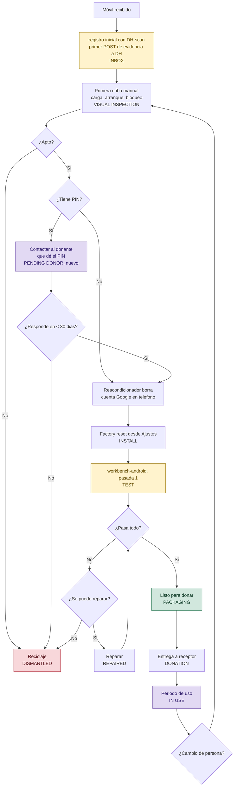

# Flujo de alto nivel

Vista resumida del recorrido de un móvil, desde su recepción hasta la entrega,
reutilización o reciclaje.

```mermaid
flowchart TD
    START[Móvil recibido] --> SCAN1[registro inicial con DH-scan<br/>primer POST de evidencia a DH<br/>INBOX]
    SCAN1 --> CRIBA[Primera criba manual<br/>carga, arranque, bloqueo<br/>VISUAL INSPECTION]
    CRIBA --> D1{¿Apto?}
    D1 -->|No| DESC[Reciclaje<br/>DISMANTLED]
    D1 -->|Sí| PIN{¿Tiene PIN?}

    PIN -->|No| ACC[Reacondicionador borra<br/>cuenta Google en telefono]
    PIN -->|Sí| CONT[Contactar al donante<br/>que dé el PIN<br/>PENDING DONOR, nuevo]
    CONT --> D2{¿Responde en < 30 dias?}
    D2 -->|Sí| ACC
    D2 -->|No| DESC

    ACC --> RESET[Factory reset desde Ajustes<br/>INSTALL]
    RESET --> WB1[workbench-android, pasada 1<br/>TEST]
    WB1 --> D3{¿Pasa todo?}
    D3 -->|No| REPP{¿Se puede reparar?}
    REPP -->|Sí| REP[Reparar<br/>REPAIRED]
    REPP -->|No| DESC
    REP --> D3
    D3 -->|Sí| READY[Listo para donar<br/>PACKAGING]

    READY --> DON[Entrega a receptor<br/>DONATION]
    DON --> USE[Periodo de uso<br/>IN USE]
    USE --> CHANGE{¿Cambio de persona?}
    CHANGE -->CRIBA
    

    classDef reject fill:#f8d7da,stroke:#b02a37,color:#58151c
    classDef ok fill:#d1e7dd,stroke:#146c43,color:#0a3622
    classDef checkpoint fill:#fff3cd,stroke:#997404,color:#664d03
    classDef newstate fill:#e2d9f3,stroke:#59359a,color:#2f1c6a
    class DESC reject
    class READY ok
    class SCAN1,WB1, checkpoint
    class CONT,USE newstate

```
