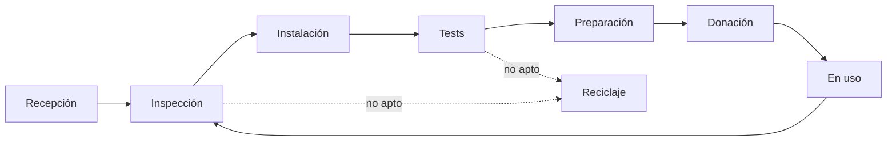

---
hide:
  - navigation
  - toc
---

# Una segunda vida para cada móvil

Vincle Digital documenta cómo recibir, revisar, borrar, probar y entregar
móviles Android con trazabilidad en DeviceHub.

[Ver el recorrido completo](diagramas-detallados.md){ .md-button .md-button--primary }
[Abrir vista rápida](diagrama-alto-nivel.md){ .md-button }

### 01 · Registrar

Etiqueta, fotos y primer alta mediante DH-scan. Cada móvil recibe un
`custom_id` que lo acompaña durante todo el proceso.

### 02 · Preparar

Comprobación de carga, arranque y bloqueos antes de retirar cuentas y ejecutar
el restablecimiento de fábrica.

### 03 · Probar

Workbench Android registra inventario y pruebas de hardware en DeviceHub; no
quedan resultados sueltos en papel.

### 04 · Entregar

El móvil limpio y preparado pasa a donación. Si vuelve, entra otra vez por
inspección visual.

## Recorrido resumido

!!! info "Documento vivo"
    Los estados nuevos, criterios pendientes y preguntas abiertas están
    marcados dentro del [flujo detallado](diagramas-detallados.md).
