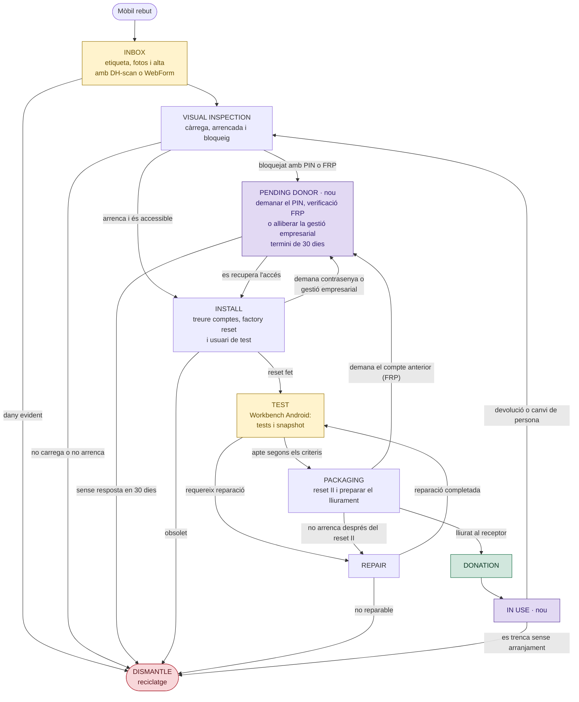

# Flux d'alt nivell

Vista resumida del recorregut d'un mòbil, des de la recepció fins al
lliurament, la reutilització o el reciclatge.

```mermaid
flowchart TD
    START(["Mòbil rebut"]) --> INBOX["INBOX<br/>etiqueta, fotos i alta<br/>amb DH-scan o WebForm"]
    INBOX -->|"dany evident"| DIS
    INBOX --> VI["VISUAL INSPECTION<br/>càrrega, arrencada i bloqueig"]

    VI -->|"no carrega o no arrenca"| DIS
    VI -->|"bloquejat amb PIN o FRP"| PD
    VI -->|"arrenca i és accessible"| INSTALL

    PD["PENDING DONOR · nou<br/>demanar el PIN, verificació FRP<br/>o alliberar la gestió empresarial<br/>termini de 30 dies"]
    PD -->|"es recupera l'accés"| INSTALL
    PD -->|"sense resposta en 30 dies"| DIS

    INSTALL["INSTALL<br/>treure comptes, factory reset<br/>i usuari de test"]
    INSTALL -->|"demana contrasenya o<br/>gestió empresarial"| PD
    INSTALL -->|"obsolet"| DIS
    INSTALL -->|"reset fet"| TEST

    TEST["TEST<br/>Workbench Android:<br/>tests i snapshot"]
    TEST -->|"apte segons els criteris"| PACK
    TEST -->|"requereix reparació"| REPAIR

    REPAIR["REPAIR"]
    REPAIR -->|"reparació completada"| TEST
    REPAIR -->|"no reparable"| DIS

    PACK["PACKAGING<br/>reset II i preparar el lliurament"]
    PACK -->|"no arrenca després del reset II"| REPAIR
    PACK -->|"demana el compte anterior (FRP)"| PD
    PACK -->|"lliurat al receptor"| DON["DONATION"]

    DON --> USE["IN USE · nou"]
    USE -->|"devolució o canvi de persona"| VI
    USE -->|"es trenca sense arranjament"| DIS

    DIS(["DISMANTLE<br/>reciclatge"])

    classDef reject fill:#f8d7da,stroke:#b02a37,color:#58151c
    classDef ok fill:#d1e7dd,stroke:#146c43,color:#0a3622
    classDef checkpoint fill:#fff3cd,stroke:#997404,color:#664d03
    classDef newstate fill:#e2d9f3,stroke:#59359a,color:#2f1c6a
    class DIS reject
    class DON ok
    class INBOX,TEST checkpoint
    class PD,USE newstate
```
