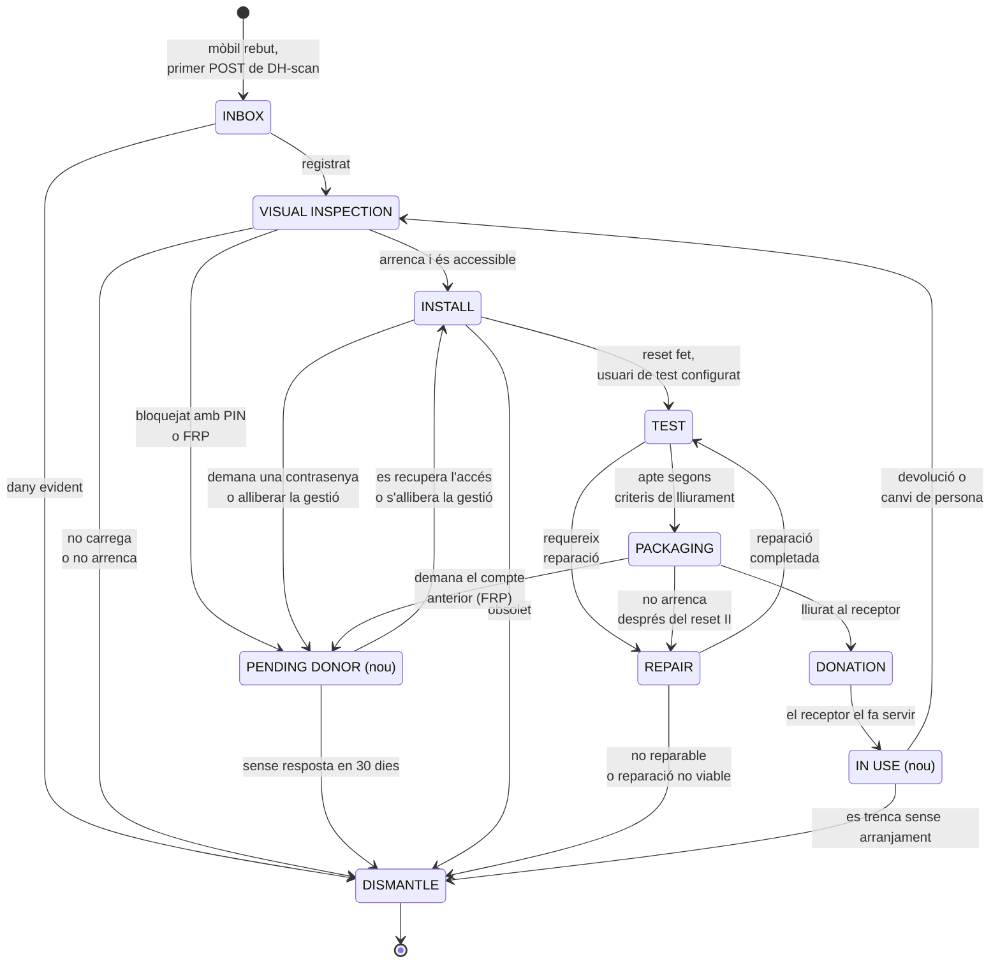
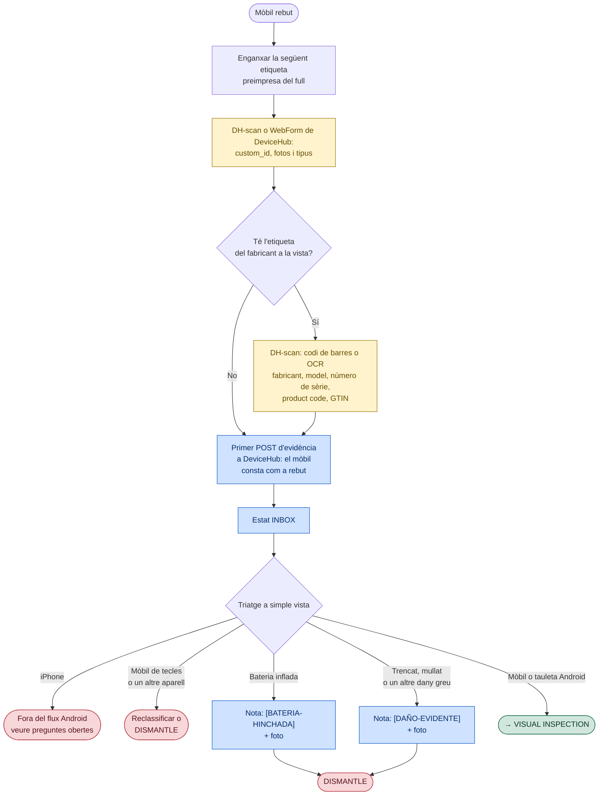
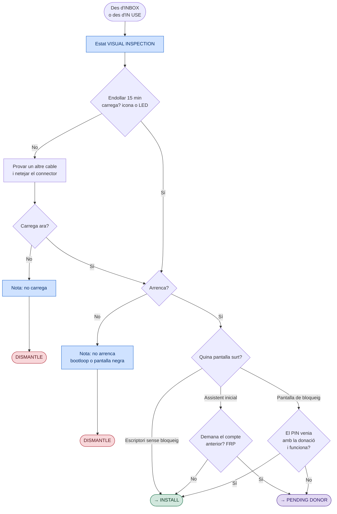
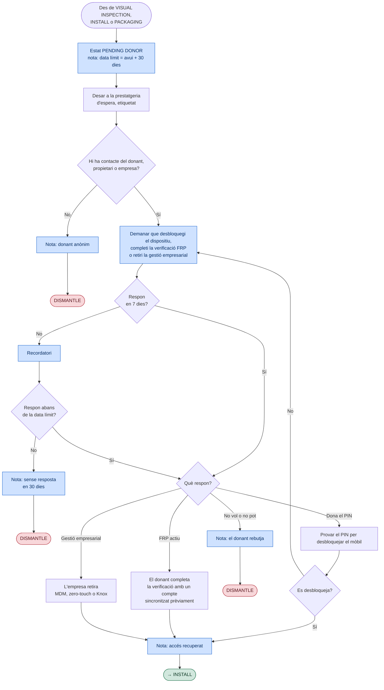
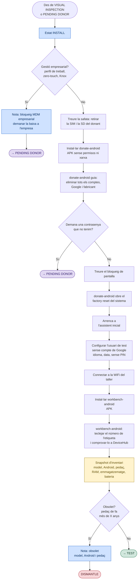
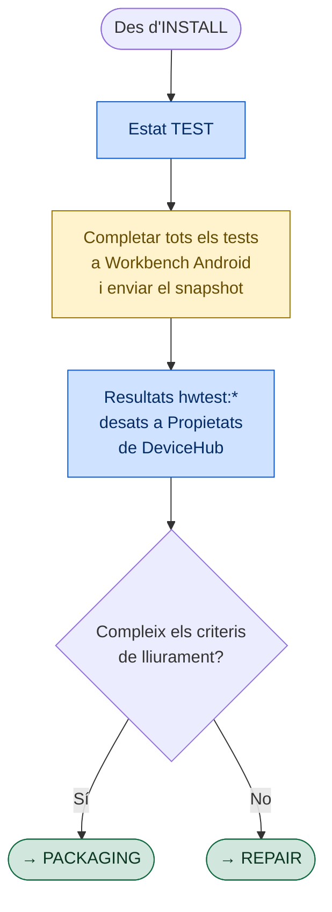
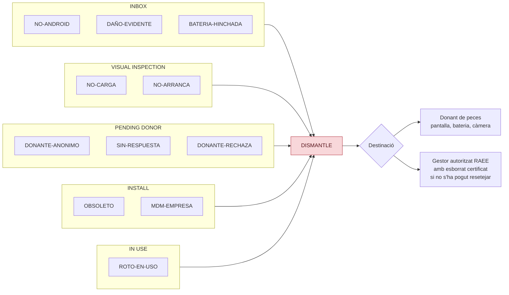

# Diagrames detallats del recondicionament de mòbils

Desenvolupa el [diagrama d'alt nivell](../diagrama-alto-nivel/) estat a estat,
encaixant cada caixa del Lucidchart "Diagrama reparació Vincle Digital" a
l'estat de DeviceHub on passa.

## Llegenda { #leyenda }

Tots els diagrames fan servir els mateixos colors:

| Color | Significat |
|---|---|
| Blau | Alguna cosa queda escrita a DeviceHub: evidència, canvi d'estat, nota o propietat |
| Groc | Checkpoint: evidència de DH-scan o snapshot de workbench-android |
| Vermell | Sortida a DISMANTLE. Sempre amb nota del motiu |
| Verd | Surt de l'estat cap al següent del camí normal |
| Morat | Estat nou que encara no existeix a DeviceHub |
| Gris | Document o fitxa de suport (caixes "document" del Lucidchart) |

---

## 1. Màquina d'estats { #1-maquina-de-estados }

La vista completa: quins estats hi ha i quines transicions són vàlides. El
detall de cada estat és a les seccions següents.

El procediment intern de REPAIR queda fora de l'abast d'aquest document. Una
reparació completada requereix repetir TEST abans de decidir si el dispositiu
és apte per a PACKAGING.

---

## 2. INBOX · Etiquetatge i triatge ràpid { #2-inbox-etiquetado-y-cribado-rapido }

És un triatge de pocs segons per mòbil: s'etiqueta, es dona d'alta i s'aparta
el que es veu a simple vista que no serveix. No s'encén el mòbil ni es busca
informació del model: en aquest punt es fa un primer registre a DeviceHub per
tenir constància dels mòbils que rebem.

**ID i etiqueta.** Les etiquetes s'imprimeixen per endavant en fulls A4 amb
numeració correlativa, amb l'eina `generar_planchas.py`.

- El QR porta només el número, no una URL: DH-scan desa el text del QR tal
  qual com a `custom_id`. A workbench-android el número es tecleja i l'app
  comprova a DeviceHub que existeix.

**Només allò evident.** Aquí es descarta el que no necessita comprovació:
pantalla trencada a trossos, bateria inflada (apartar l'aparell pel risc
d'incendi) o senyals clars d'aigua. La resta del maquinari el prova
workbench-android a TEST.

Queda a DeviceHub en sortir d'INBOX:

| Dada | Origen |
|---|---|
| `custom_id` | QR de l'etiqueta, llegit per DH-scan i enviat al primer POST |
| tipus | `DeviceType` de mòbil o de tauleta de la institució |
| fotos | DH-scan o WebForm de DeviceHub |
| fabricant, model, número de sèrie, product code, GTIN | Codi de barres o OCR de l'etiqueta, si n'hi ha, com a propietats |
| estat `INBOX` | La guia el marca després del primer POST, amb el token API o a mà |

---

## 3. VISUAL INSPECTION · Càrrega, arrencada i bloqueig { #3-visual-inspection-carga-arranque-y-bloqueo }

Respon al que workbench-android no pot comprovar perquè encara no està
instal·lat: si el mòbil carrega, si arrenca i si hi podem entrar. Tota la
resta es mira en un altre lloc:

La càrrega va abans que l'arrencada perquè un mòbil sense bateria no arrenca i
no es pot distingir d'un d'espatllat. No cal carregar-lo més: n'hi ha prou que
s'encengui. Si hi ha un tester USB a mà, es pot fer servir per comprovar si el
mòbil consumeix corrent encara que no mostri cap icona ni LED. El consum
concret depèn del model, de la bateria i de la fase de càrrega.

Mai no es proven PIN a cegues: després de diversos intents el mòbil es
bloqueja durant un temps o s'esborra, i això darrer deixa l'FRP armat.

---

## 4. PENDING DONOR (RELEASE) · Espera d'alliberament (estat nou) { #4-pending-donor-release-espera-de-liberacion-estado-nuevo }

Espera l'actuació del donant, propietari o empresa per obtenir un PIN,
completar la verificació FRP o retirar la gestió empresarial.

---

## 5. INSTALL · Esborrat de comptes, reset i registre amb workbench-android { #5-install-borrado-de-cuentas-reset-y-registro-con-workbench-android }

**donate-android** guia l'esborrat de comptes i obre el factory reset del mateix
Android: l'app no pot fer el reset ni saltar-se res. No demana permisos ni té
accés a la xarxa, així que es pot instal·lar en un mòbil que encara té dades
del donant. workbench-android, en canvi, s'instal·la després del reset. L'última
APK publicada es descarrega des de
[`apps.sergiogimenez.com/workbench`](https://apps.sergiogimenez.com/workbench).

L'ordre importa: comptes fora **abans** del reset. Si es reseteja amb el compte
posat, apareix l'FRP i només el propietari el pot treure. No s'intenta cap
bypass de l'FRP.

### Què reporta workbench-android { #que-reporta-workbench-android }

El que necessitem del registre i el que envia l'app al snapshot. El que arriba
a DeviceHub com a propietat es veu a la fitxa del producte.

| Dada | Per a què | A l'app | A DeviceHub |
|---|---|---|---|
| `custom_id` | Unir amb l'alta de DH-scan | Es tecleja i es comprova que existeix a DeviceHub abans d'enviar (l'etiqueta és a la part del darrere del mateix mòbil, la seva càmera no la veu) | Identificador del producte |
| Tipus | Mòbil o tauleta | `Smartphone` o `Tablet` (pantalla ≥ 600 dp) | Tipus del producte |
| Fabricant, marca, model | Fitxa | Sí, de `Build` | Sí |
| Versió d'Android, API | Fitxa, obsolet | Sí | `android:version`, `android:api_level` |
| Pedaç de seguretat | Decidir obsolet | Sí, `Build.VERSION.SECURITY_PATCH` | `android:security_patch` |
| Obsolet | Sortida a DISMANTLE | No | Falta la regla: es decideix amb `android:security_patch` |
| CPU, RAM, emmagatzematge, pantalla, càmeres, sensors | Fitxa | Sí | Components |
| Bateria: nivell, salut, voltatge, temperatura | Fitxa, TEST | Sí | Component bateria |
| Cicles de bateria | Desgast | Només API 34+ i segons el fabricant | Sense alternativa fiable |
| Salut de la bateria en % | Desgast | No, fixat a `null` | Depèn del fabricant |
| Número de sèrie | Fitxa | No | No accessible sense privilegis des de l'API 29. Surt de l'etiqueta (DH-scan) |
| IMEI | Fitxa, traçabilitat | No | No accessible des de l'API 29. `*#06#` a mà |
| SIM o SD a dins | Control d'INSTALL, abans del reset | Parcial: el test de SIM demana retirar-la | La SD no es comprova |
| Specs PD (càrrega ràpida) | Carregador de lliurament | No | Android no ho exposa: fitxa del fabricant |

Falta fixar la X del criteri d'obsolet.

---

## 6. TEST · Diagnòstic amb workbench-android { #6-test-diagnostico-con-workbench-android }

**La idea és que tots els tests es facin des de workbench-android**, sense
proves a mà ni diagnòstics de fàbrica: és l'única manera que el taller no perdi
temps i que cada resultat quedi al snapshot.

Workbench guia totes les proves —incloses la SIM i la bateria quan
correspongui—, registra `PASS`, `FAIL` o `SKIP` i envia el snapshot. La guia
del taller només confirma que s'ha completat aquest recorregut, sense
duplicar-lo com a checklist. Els resultats queden a DeviceHub i, segons els
criteris de lliurament, el mòbil passa a PACKAGING o a REPAIR.

### Què fa workbench-android { #que-hace-workbench-android }

Tots els tests del diagrama són a l'app. Cada resultat arriba a DeviceHub com a
propietat `hwtest:<id>`. Si canvia entre passades, el canvi queda al registre
del producte.

| Test | Ids de resultat | Com decideix |
|---|---|---|
| Pantalla, tàctil, multitàctil | `screen`, `touch`, `multitouch` | Operari; el tàctil passa només en cobrir la graella |
| Sensors | `accelerometer`, `gyroscope`, `magnetometer`, `proximity`, `light` | Passa si la lectura canvia; SKIP si no existeix |
| Vibració, llanterna | `vibration`, `flashlight` | Operari |
| Càrrega | `charging` | Pass només amb el carregador detectat |
| WiFi | `wifi` | Pass només amb WiFi validada pel sistema |
| Àudio | `speaker`, `earpiece`, `microphone` | Operari; auricular SKIP si no n'hi ha; el micròfon grava i reprodueix |
| Càmeres | `camera_back`, `camera_front` | Operari amb la vista prèvia; SKIP si no n'hi ha |
| Botons | `volume_up`, `volume_down`, `power` | Detectats: tecles de volum i pantalla apagada |
| Bluetooth | `bluetooth` | Pass amb almenys un dispositiu visible trobat |
| GPS | `gps` | Pass amb satèl·lits visibles; la nota porta satèl·lits i fix |
| SIM | `sim`, `cellular_network`, `call`, `mobile_data` | SIM a punt, registre a la xarxa, trucada pel marcador, dades validades. SKIP sense telefonia |
| Bateria | `battery_drain` | Descàrrega de 15, 30 o 60 min; la caiguda va a la nota |

Encara sense provar en un mòbil real: llegir un QR real, auricular, micròfon
amb veu, Bluetooth amb dispositius a prop i la trucada. A l'emulador funcionen
el recorregut complet, la represa i l'enviament a DeviceHub.

---

## 7. PACKAGING → DONATION → IN USE · Preparació, lliurament i ús { #7-packaging-donation-in-use-preparacion-entrega-y-uso }

```mermaid
flowchart TD
    IN(["Des de TEST<br/>apte per al lliurament"]) --> ST_P["Estat PACKAGING"]:::dh

    ST_P --> RESET2["Reset II<br/>factory reset des d'Ajustos:<br/>esborra l'usuari de test i la WiFi"]
    RESET2 --> ASIST{"Arrencada correcta a l'assistent<br/>inicial sense demanar compte?"}
    ASIST -->|"No"| REP(["→ REPAIR"]):::ok
    ASIST -->|"Sí"| FRP{"Demana un compte<br/>anterior? FRP"}

    FRP -->|"Sí"| PEND(["→ PENDING DONOR"]):::newstate
    FRP -->|"No"| APAGAR["Apagar amb la<br/>bateria al 50-80 %"]
    APAGAR --> LIMPIEZA["Neteja exterior<br/>i protector si cal"]
    LIMPIEZA --> KIT["Kit: mòbil, carregador,<br/>cable, funda,<br/>guia de primers passos"]
    KIT --> ETIQ["Etiqueta QR visible<br/>amb custom_id"]
    ETIQ --> ESPERA["Prestatgeria de llestos"]

    ESPERA --> ASIGN{"Hi ha receptor<br/>assignat?"}
    ASIGN -->|"No"| ESPERA
    ASIGN -->|"Sí"| ENTREGA["Lliurament al receptor<br/>signatura de recepció"]

    ENTREGA --> ST_D["Estat DONATION<br/>nota: entitat o receptor"]:::dh
    ST_D --> CONF["Primera configuració<br/>amb el receptor si ho necessita"]
    CONF --> ST_U["Estat IN USE"]:::newstate

    ST_U --> CHK["Passada de workbench-android<br/>periòdica o en tornar"]:::checkpoint
    CHK --> EVENTO{"Què passa?"}
    EVENTO -->|"Continua en ús"| ST_U
    EVENTO -->|"Canvi de persona<br/>o devolució"| VI(["→ VISUAL INSPECTION"]):::ok
    EVENTO -->|"Es trenca"| REV{"Reparable?"}
    REV -->|"Sí"| VI
    REV -->|"No"| DIS(["DISMANTLE"]):::reject

    classDef reject fill:#f8d7da,stroke:#b02a37,color:#58151c
    classDef ok fill:#d1e7dd,stroke:#146c43,color:#0a3622
    classDef checkpoint fill:#fff3cd,stroke:#997404,color:#664d03
    classDef dh fill:#cfe2ff,stroke:#0a58ca,color:#052c65
    classDef newstate fill:#e2d9f3,stroke:#59359a,color:#2f1c6a
```

La tornada des d'IN USE entra per VISUAL INSPECTION i no per TEST: el mòbil ha
estat en mans d'una altra persona i pot tornar amb comptes, PIN o danys nous.

Cada fila `DONATION` de l'historial obre un període d'ús i la transició
següent el tanca. Amb això es calculen les hores d'impacte social sense marcar
evidències a mà.

---

## 8. DISMANTLE · Catàleg de motius { #8-dismantle-catalogo-de-motivos }

Totes les sortides vermelles acaben aquí. Per poder comptar després per què es
perden mòbils, el motiu ha de ser un d'aquesta llista i anar al principi de la
nota del canvi d'estat, per exemple `[NO-CARGA] provat amb dos cables`. Els
codis es mantenen en castellà en tots els idiomes perquè es puguin comptar
plegats.

| Codi | Significat |
|---|---|
| `NO-ANDROID` | No és un mòbil o tauleta Android |
| `DAÑO-EVIDENTE` | Dany físic evident |
| `BATERIA-HINCHADA` | Bateria inflada |
| `NO-CARGA` | No carrega |
| `NO-ARRANCA` | No arrenca |
| `DONANTE-ANONIMO` | Donant anònim |
| `SIN-RESPUESTA` | Sense resposta en 30 dies |
| `DONANTE-RECHAZA` | El donant rebutja |
| `OBSOLETO` | Obsolet |
| `MDM-EMPRESA` | Bloqueig MDM d'empresa |
| `ROTO-EN-USO` | Trencat durant l'ús sense arranjament |

---

## Preguntes obertes { #preguntas-abiertas }

Decisions preses per poder dibuixar i que convé validar:

1. **iPhone.** Què en fem?
2. **Criteri d'obsolet.** Quants anys d'antiguitat del pedaç de seguretat fan obsolet un mòbil?
3. **Llindar de bateria.** "Descàrrega excessiva en 60 minuts" necessita un número concret per grau.
