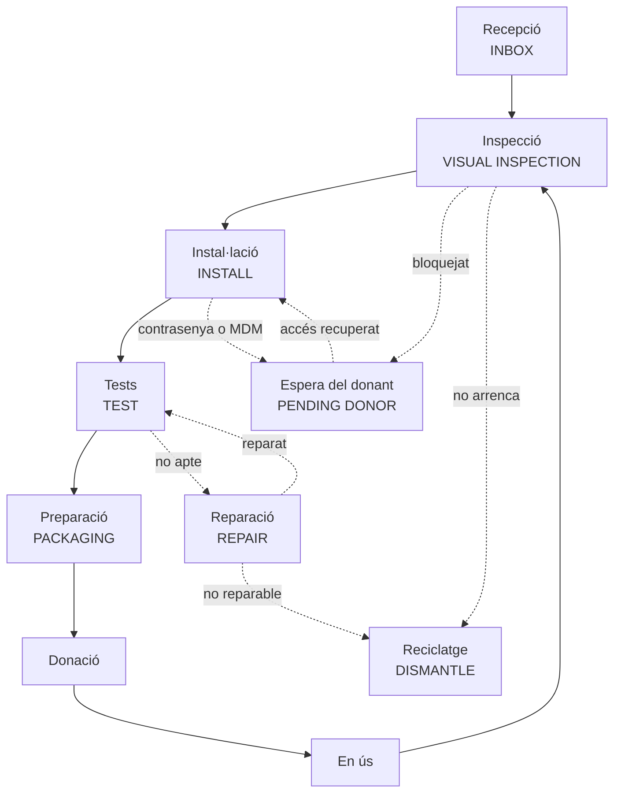

---
hide:
  - navigation
  - toc
---

# Una segona vida per a cada mòbil

Vincle Digital documenta com rebre, revisar, esborrar, provar i lliurar
mòbils Android amb traçabilitat a DeviceHub.

[Veure el recorregut complet](diagramas-detallados.md){ .md-button .md-button--primary }
[Obrir la vista ràpida](diagrama-alto-nivel.md){ .md-button }
[Fer servir la guia pas a pas](guia-app.md){ .md-button }

### 01 · Registrar { #01-registrar }

Etiqueta, fotos i primera alta amb DH-scan o el WebForm de DeviceHub. Cada
mòbil rep un `custom_id` que l'acompanya durant tot el procés.

### 02 · Preparar { #02-preparar }

Comprovació de càrrega, arrencada i bloquejos abans de retirar comptes i
executar el restabliment de fàbrica.

### 03 · Provar { #03-probar }

Workbench Android registra l'inventari i les proves de maquinari a DeviceHub;
no queden resultats solts en paper.

### 04 · Lliurar { #04-entregar }

El mòbil net i preparat passa a donació. Si torna, entra una altra vegada per
la inspecció visual.

## Recorregut resumit { #recorrido-resumido }

!!! info "Document viu"
    Els estats nous, els criteris pendents i les preguntes obertes estan
    marcats dins del [flux detallat](diagramas-detallados.md).
