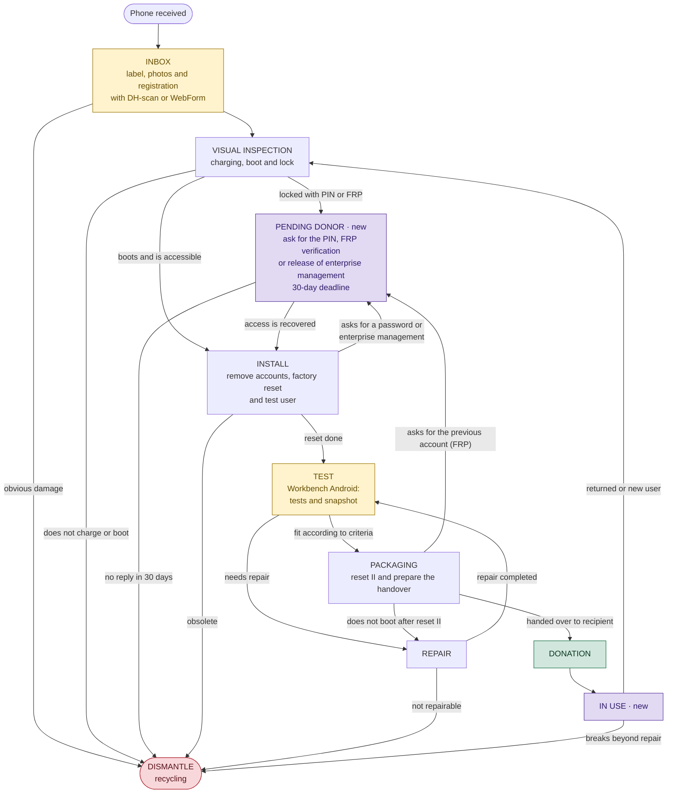

# High-level flow

A summary of a phone's route, from reception to handover, reuse or
recycling.

```mermaid
flowchart TD
    START(["Phone received"]) --> INBOX["INBOX<br/>label, photos and registration<br/>with DH-scan or WebForm"]
    INBOX -->|"obvious damage"| DIS
    INBOX --> VI["VISUAL INSPECTION<br/>charging, boot and lock"]

    VI -->|"does not charge or boot"| DIS
    VI -->|"locked with PIN or FRP"| PD
    VI -->|"boots and is accessible"| INSTALL

    PD["PENDING DONOR · new<br/>ask for the PIN, FRP verification<br/>or release of enterprise management<br/>30-day deadline"]
    PD -->|"access is recovered"| INSTALL
    PD -->|"no reply in 30 days"| DIS

    INSTALL["INSTALL<br/>remove accounts, factory reset<br/>and test user"]
    INSTALL -->|"asks for a password or<br/>enterprise management"| PD
    INSTALL -->|"obsolete"| DIS
    INSTALL -->|"reset done"| TEST

    TEST["TEST<br/>Workbench Android:<br/>tests and snapshot"]
    TEST -->|"fit according to criteria"| PACK
    TEST -->|"needs repair"| REPAIR

    REPAIR["REPAIR"]
    REPAIR -->|"repair completed"| TEST
    REPAIR -->|"not repairable"| DIS

    PACK["PACKAGING<br/>reset II and prepare the handover"]
    PACK -->|"does not boot after reset II"| REPAIR
    PACK -->|"asks for the previous account (FRP)"| PD
    PACK -->|"handed over to recipient"| DON["DONATION"]

    DON --> USE["IN USE · new"]
    USE -->|"returned or new user"| VI
    USE -->|"breaks beyond repair"| DIS

    DIS(["DISMANTLE<br/>recycling"])

    classDef reject fill:#f8d7da,stroke:#b02a37,color:#58151c
    classDef ok fill:#d1e7dd,stroke:#146c43,color:#0a3622
    classDef checkpoint fill:#fff3cd,stroke:#997404,color:#664d03
    classDef newstate fill:#e2d9f3,stroke:#59359a,color:#2f1c6a
    class DIS reject
    class DON ok
    class INBOX,TEST checkpoint
    class PD,USE newstate
```
