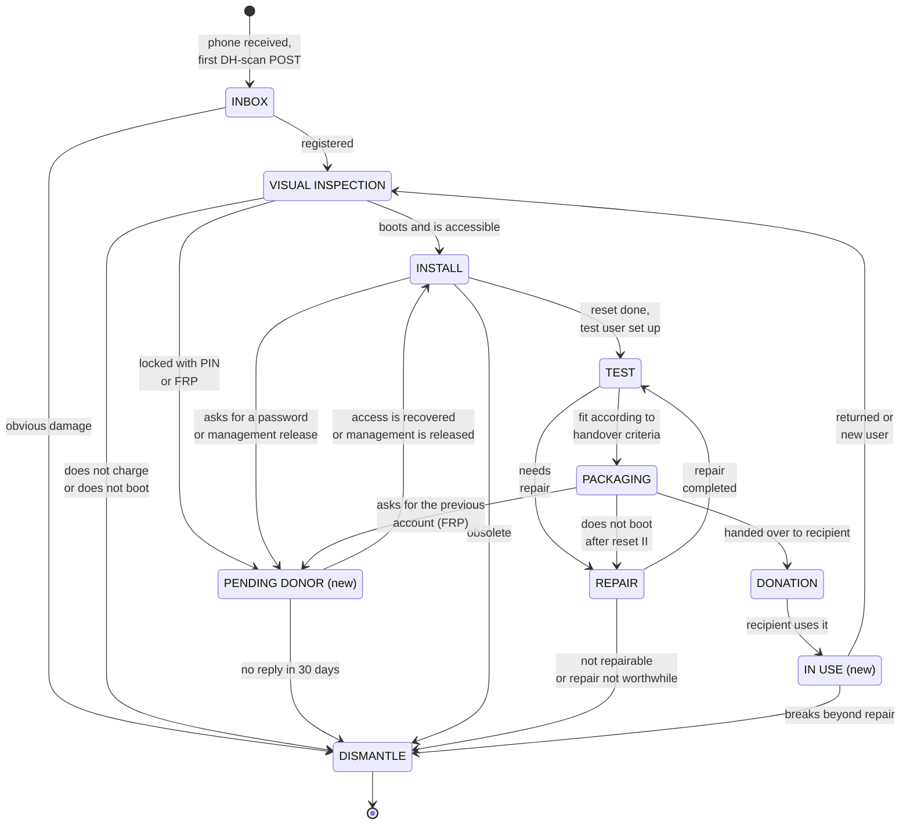
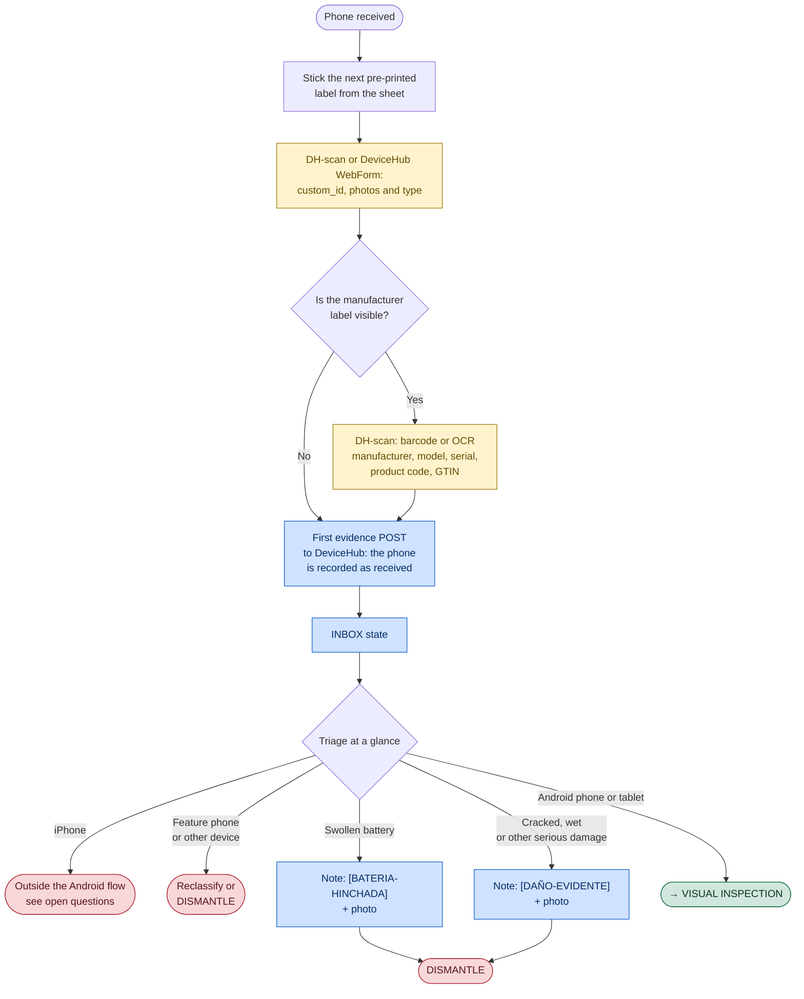
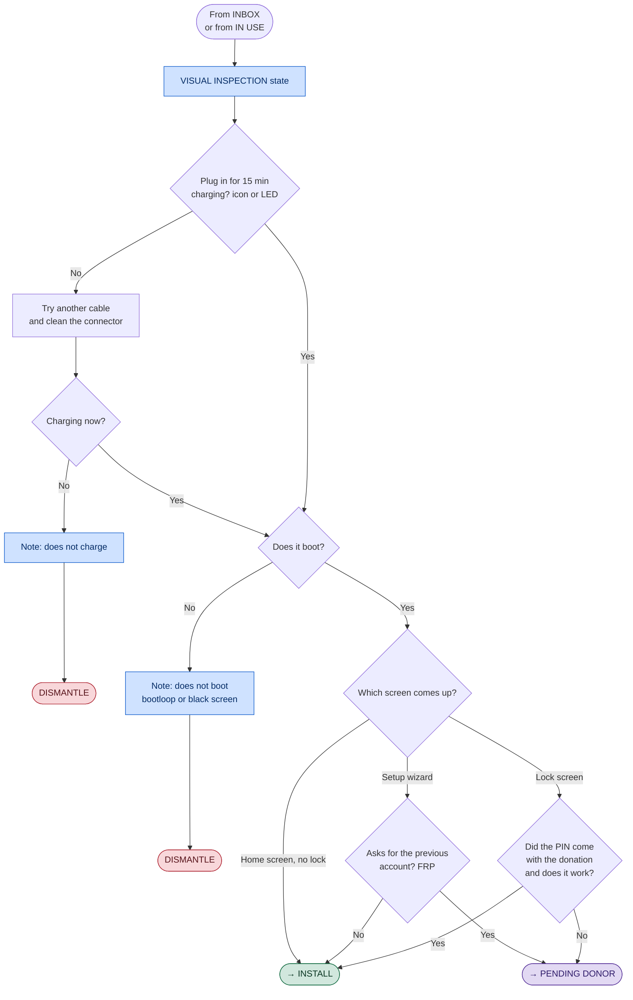
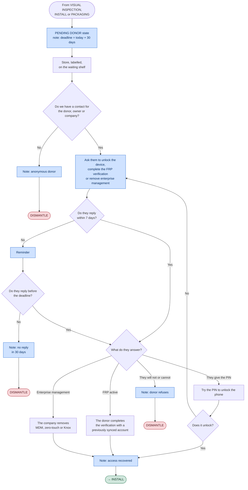
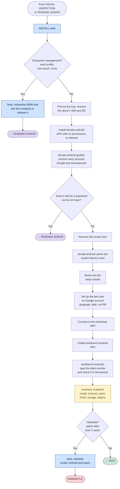
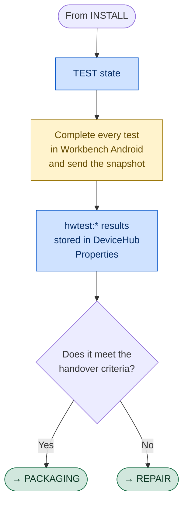
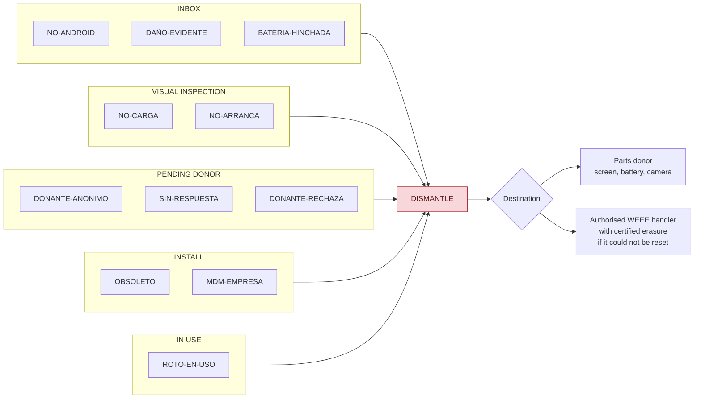

# Detailed phone refurbishing diagrams

Expands the [high-level diagram](../diagrama-alto-nivel/) state by state,
fitting each box of the Lucidchart "Diagrama reparació Vincle Digital" into the
DeviceHub state where it happens.

## Legend { #leyenda }

All diagrams use the same colours:

| Colour | Meaning |
|---|---|
| Blue | Something is written to DeviceHub: evidence, state change, note or property |
| Yellow | Checkpoint: DH-scan evidence or workbench-android snapshot |
| Red | Exit to DISMANTLE. Always with a note giving the reason |
| Green | Leaves the state towards the next one on the normal path |
| Purple | New state that does not exist in DeviceHub yet |
| Grey | Supporting document or sheet ("document" boxes in the Lucidchart) |

---

## 1. State machine { #1-maquina-de-estados }

The complete view: which states exist and which transitions are valid. Each
state is detailed in the following sections.

The internal REPAIR procedure is outside the scope of this document. A
completed repair requires repeating TEST before deciding whether the device
is fit for PACKAGING.

---

## 2. INBOX · Labelling and quick triage { #2-inbox-etiquetado-y-cribado-rapido }

A triage of a few seconds per phone: it is labelled, registered, and anything
that is obviously useless at a glance is set aside. The phone is not switched
on and the model is not looked up: at this point a first record is made in
DeviceHub so that we know which phones we receive.

**ID and label.** Labels are printed in advance on A4 sheets with sequential
numbering, using the `generar_planchas.py` tool.

- The QR holds only the number, not a URL: DH-scan stores the QR text as is
  as the `custom_id`. In workbench-android the number is typed and the app
  checks in DeviceHub that it exists.

**Only the obvious.** Anything that needs no checking is discarded here: a
screen broken into pieces, a swollen battery (set the device aside because of
the fire risk) or clear signs of water. The rest of the hardware is tested by
workbench-android in TEST.

Recorded in DeviceHub when leaving INBOX:

| Data | Source |
|---|---|
| `custom_id` | Label QR, read by DH-scan and sent in the first POST |
| type | The organisation's phone or tablet `DeviceType` |
| photos | DH-scan or DeviceHub WebForm |
| manufacturer, model, serial, product code, GTIN | Barcode or OCR of the label, if there is one, as properties |
| `INBOX` state | The guide sets it after the first POST, with the API token or by hand |

---

## 3. VISUAL INSPECTION · Charging, boot and lock { #3-visual-inspection-carga-arranque-y-bloqueo }

Answers what workbench-android cannot check because it is not installed yet:
whether the phone charges, whether it boots and whether we can get in.
Everything else is checked elsewhere:

Charging comes before booting because a phone with a flat battery does not
boot and cannot be told apart from a broken one. It does not need to charge
any further: it only has to switch on. If a USB tester is at hand, it can be
used to check whether the phone is drawing current even if it shows no icon
or LED. The exact draw depends on the model, the battery and the charging
phase.

PINs are never guessed: after a few attempts the phone locks for a while or
wipes itself, and a wipe leaves FRP armed.

---

## 4. PENDING DONOR (RELEASE) · Waiting for release (new state) { #4-pending-donor-release-espera-de-liberacion-estado-nuevo }

Waits for the donor, owner or company to act: to provide a PIN, complete the
FRP verification or remove enterprise management.

---

## 5. INSTALL · Account removal, reset and registration with workbench-android { #5-install-borrado-de-cuentas-reset-y-registro-con-workbench-android }

**donate-android** guides the account removal and opens Android's own factory
reset: the app cannot do the reset or skip anything. It asks for no
permissions and has no network access, so it can be installed on a phone that
still holds the donor's data. workbench-android, on the other hand, is
installed after the reset. The latest published APK is downloaded from
[`apps.sergiogimenez.com/workbench`](https://apps.sergiogimenez.com/workbench).

Order matters: accounts out **before** the reset. If the phone is reset with an
account still signed in, FRP kicks in and only the owner can remove it. No
FRP bypass is ever attempted.

### What workbench-android reports { #que-reporta-workbench-android }

What we need from the record and what the app sends in the snapshot. Whatever
reaches DeviceHub as a property is shown on the product page.

| Data | What for | In the app | In DeviceHub |
|---|---|---|---|
| `custom_id` | Link to the DH-scan registration | Typed in and checked to exist in DeviceHub before sending (the label is on the back of the phone itself, its camera cannot see it) | Product identifier |
| Type | Phone or tablet | `Smartphone` or `Tablet` (screen ≥ 600 dp) | Product type |
| Manufacturer, brand, model | Record | Yes, from `Build` | Yes |
| Android version, API | Record, obsolete | Yes | `android:version`, `android:api_level` |
| Security patch | Decide obsolete | Yes, `Build.VERSION.SECURITY_PATCH` | `android:security_patch` |
| Obsolete | Exit to DISMANTLE | No | Rule missing: decided with `android:security_patch` |
| CPU, RAM, storage, screen, cameras, sensors | Record | Yes | Components |
| Battery: level, health, voltage, temperature | Record, TEST | Yes | Battery component |
| Battery cycles | Wear | Only API 34+ and depending on manufacturer | No reliable alternative |
| Battery health in % | Wear | No, fixed to `null` | Depends on manufacturer |
| Serial | Record | No | Not accessible without privileges since API 29. Taken from the label (DH-scan) |
| IMEI | Record, traceability | No | Not accessible since API 29. `*#06#` by hand |
| SIM or SD inside | INSTALL check, before the reset | Partial: the SIM test asks to remove it | The SD is not checked |
| PD specs (fast charging) | Charger for handover | No | Android does not expose it: manufacturer's spec sheet |

The X in the obsolescence criterion is still to be decided.

---

## 6. TEST · Diagnostics with workbench-android { #6-test-diagnostico-con-workbench-android }

**The idea is that every test is run from workbench-android**, with no manual
checks or factory diagnostics: it is the only way for the workshop not to
waste time and for every result to end up in the snapshot.

Workbench guides every test (including SIM and battery when applicable),
records `PASS`, `FAIL` or `SKIP` and sends the snapshot. The workshop guide
only confirms that this run has been completed, without duplicating it as a
checklist. The results stay in DeviceHub and, depending on the handover
criteria, the phone moves to PACKAGING or REPAIR.

### What workbench-android does { #que-hace-workbench-android }

Every test in the diagram is in the app. Each result reaches DeviceHub as an
`hwtest:<id>` property. If it changes between runs, the change is kept in the
product log.

| Test | Result ids | How it decides |
|---|---|---|
| Screen, touch, multitouch | `screen`, `touch`, `multitouch` | Operator; touch passes only when the grid is covered |
| Sensors | `accelerometer`, `gyroscope`, `magnetometer`, `proximity`, `light` | Passes if the reading changes; SKIP if missing |
| Vibration, flashlight | `vibration`, `flashlight` | Operator |
| Charging | `charging` | Pass only with the charger detected |
| WiFi | `wifi` | Pass only with WiFi validated by the system |
| Audio | `speaker`, `earpiece`, `microphone` | Operator; earpiece SKIP if missing; the microphone records and plays back |
| Cameras | `camera_back`, `camera_front` | Operator with the preview; SKIP if missing |
| Buttons | `volume_up`, `volume_down`, `power` | Detected: volume keys and screen off |
| Bluetooth | `bluetooth` | Pass with at least one visible device found |
| GPS | `gps` | Pass with visible satellites; the note has satellites and fix |
| SIM | `sim`, `cellular_network`, `call`, `mobile_data` | SIM ready, network registration, call through the dialler, data validated. SKIP without telephony |
| Battery | `battery_drain` | Discharge over 15, 30 or 60 min; the drop goes in the note |

Not yet tried on a real phone: reading a real QR, earpiece, microphone with
voice, Bluetooth with devices nearby and the call. On the emulator the full
run, resuming and sending to DeviceHub all work.

---

## 7. PACKAGING → DONATION → IN USE · Preparation, handover and use { #7-packaging-donation-in-use-preparacion-entrega-y-uso }

```mermaid
flowchart TD
    IN(["From TEST<br/>fit for handover"]) --> ST_P["PACKAGING state"]:::dh

    ST_P --> RESET2["Reset II<br/>factory reset from Settings:<br/>wipes test user and WiFi"]
    RESET2 --> ASIST{"Boots properly into the setup<br/>wizard without asking for an account?"}
    ASIST -->|"No"| REP(["→ REPAIR"]):::ok
    ASIST -->|"Yes"| FRP{"Asks for a previous<br/>account? FRP"}

    FRP -->|"Yes"| PEND(["→ PENDING DONOR"]):::newstate
    FRP -->|"No"| APAGAR["Switch off with<br/>battery at 50-80 %"]
    APAGAR --> LIMPIEZA["Clean the outside<br/>and fit a protector if needed"]
    LIMPIEZA --> KIT["Kit: phone, charger,<br/>cable, case,<br/>getting-started guide"]
    KIT --> ETIQ["QR label visible<br/>with custom_id"]
    ETIQ --> ESPERA["Ready shelf"]

    ESPERA --> ASIGN{"Is a recipient<br/>assigned?"}
    ASIGN -->|"No"| ESPERA
    ASIGN -->|"Yes"| ENTREGA["Handover to the recipient<br/>signed receipt"]

    ENTREGA --> ST_D["DONATION state<br/>note: organisation or recipient"]:::dh
    ST_D --> CONF["First setup<br/>with the recipient if needed"]
    CONF --> ST_U["IN USE state"]:::newstate

    ST_U --> CHK["workbench-android run<br/>periodically or when it comes back"]:::checkpoint
    CHK --> EVENTO{"What happens?"}
    EVENTO -->|"Still in use"| ST_U
    EVENTO -->|"New user<br/>or returned"| VI(["→ VISUAL INSPECTION"]):::ok
    EVENTO -->|"It breaks"| REV{"Repairable?"}
    REV -->|"Yes"| VI
    REV -->|"No"| DIS(["DISMANTLE"]):::reject

    classDef reject fill:#f8d7da,stroke:#b02a37,color:#58151c
    classDef ok fill:#d1e7dd,stroke:#146c43,color:#0a3622
    classDef checkpoint fill:#fff3cd,stroke:#997404,color:#664d03
    classDef dh fill:#cfe2ff,stroke:#0a58ca,color:#052c65
    classDef newstate fill:#e2d9f3,stroke:#59359a,color:#2f1c6a
```

The return from IN USE goes through VISUAL INSPECTION and not TEST: the phone
has been in someone else's hands and may come back with accounts, a PIN or new
damage.

Each `DONATION` row in the history opens a period of use and the next
transition closes it. That is how the hours of social impact are calculated
without recording evidence by hand.

---

## 8. DISMANTLE · Reason catalogue { #8-dismantle-catalogo-de-motivos }

Every red exit ends here. To be able to count later why phones are lost, the
reason must be one from this list and go at the start of the state-change
note, for example `[NO-CARGA] tried with two cables`. The codes stay in
Spanish in every language so they can be counted together.

| Code | Meaning |
|---|---|
| `NO-ANDROID` | Not an Android phone or tablet |
| `DAÑO-EVIDENTE` | Obvious physical damage |
| `BATERIA-HINCHADA` | Swollen battery |
| `NO-CARGA` | Does not charge |
| `NO-ARRANCA` | Does not boot |
| `DONANTE-ANONIMO` | Anonymous donor |
| `SIN-RESPUESTA` | No reply in 30 days |
| `DONANTE-RECHAZA` | The donor refuses |
| `OBSOLETO` | Obsolete |
| `MDM-EMPRESA` | Enterprise MDM lock |
| `ROTO-EN-USO` | Broke during use, beyond repair |

---

## Open questions { #preguntas-abiertas }

Decisions taken in order to draw the diagrams, which should be validated:

1. **iPhone.** What do we do with them?
2. **Obsolescence criterion.** How many years old must the security patch be for a phone to count as obsolete?
3. **Battery threshold.** "Excessive discharge in 60 minutes" needs a concrete number per grade.
