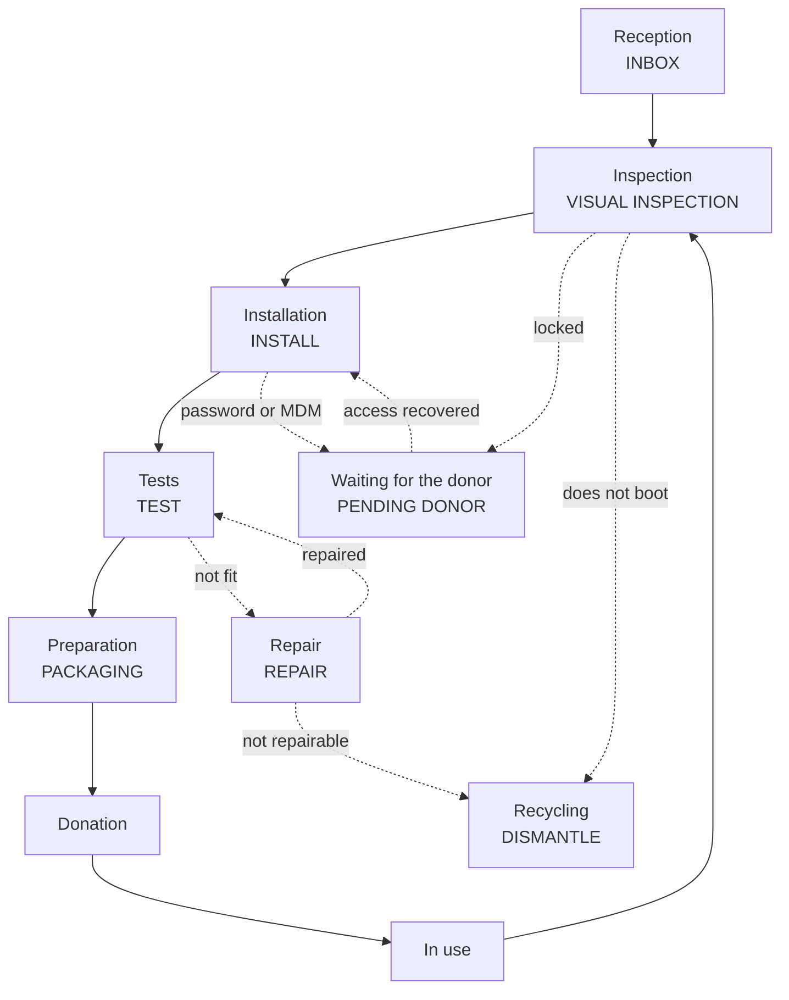

---
hide:
  - navigation
  - toc
---

# A second life for every phone

Vincle Digital documents how to receive, check, wipe, test and hand over
Android phones with traceability in DeviceHub.

[See the full route](diagramas-detallados.md){ .md-button .md-button--primary }
[Open the quick view](diagrama-alto-nivel.md){ .md-button }
[Use the step-by-step guide](guia-app.md){ .md-button }

### 01 · Register { #01-registrar }

Label, photos and first registration with DH-scan or the DeviceHub WebForm.
Each phone gets a `custom_id` that stays with it throughout the process.

### 02 · Prepare { #02-preparar }

Check charging, booting and locks before removing accounts and running the
factory reset.

### 03 · Test { #03-probar }

Workbench Android records the inventory and hardware tests in DeviceHub; no
results are left lying around on paper.

### 04 · Hand over { #04-entregar }

The clean, prepared phone goes to donation. If it comes back, it re-enters
through visual inspection.

## Route at a glance { #recorrido-resumido }

!!! info "Living document"
    New states, pending criteria and open questions are marked in the
    [detailed flow](diagramas-detallados.md).
